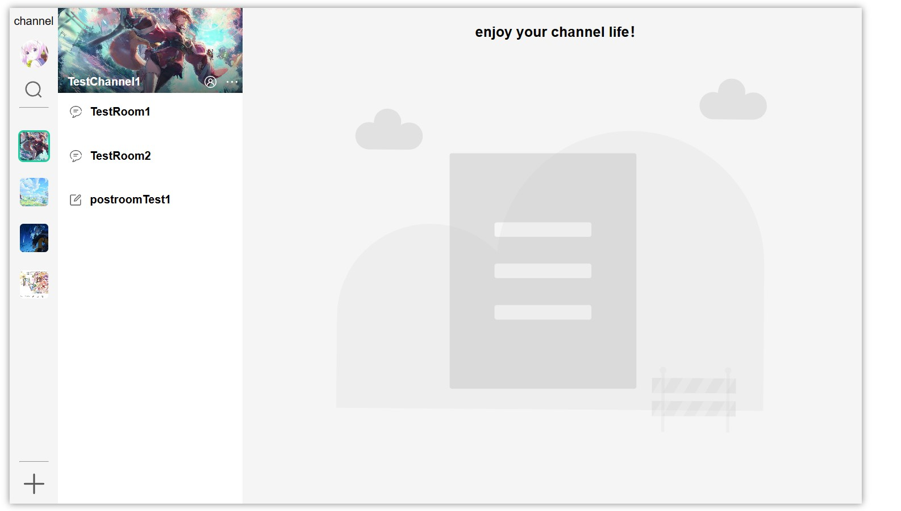
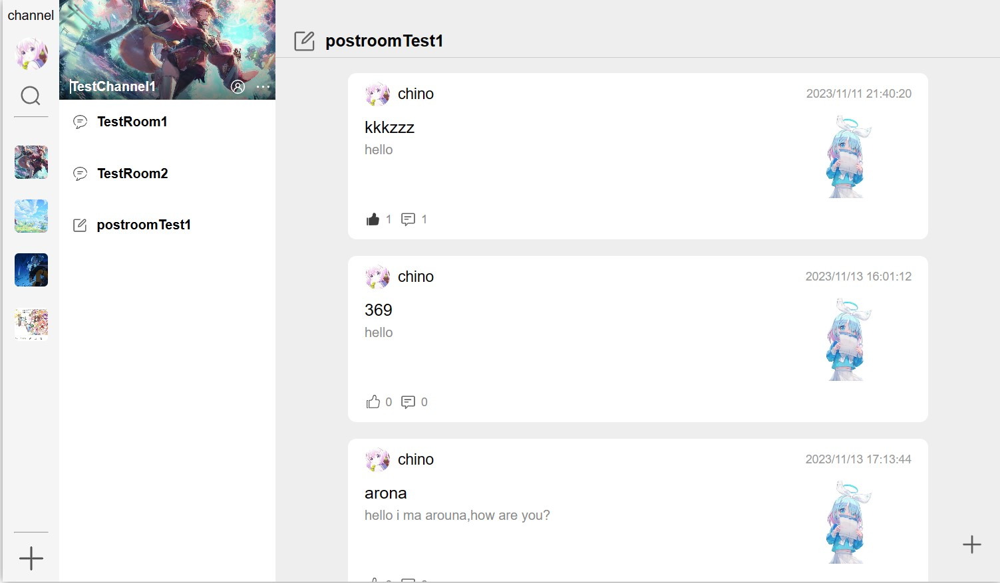
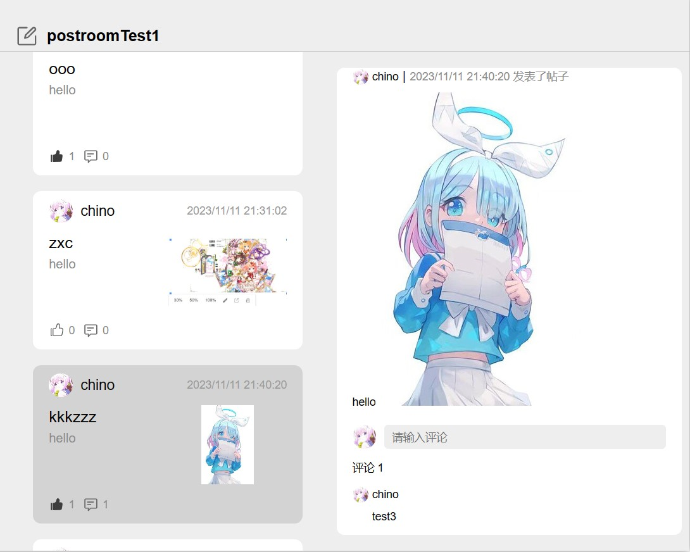
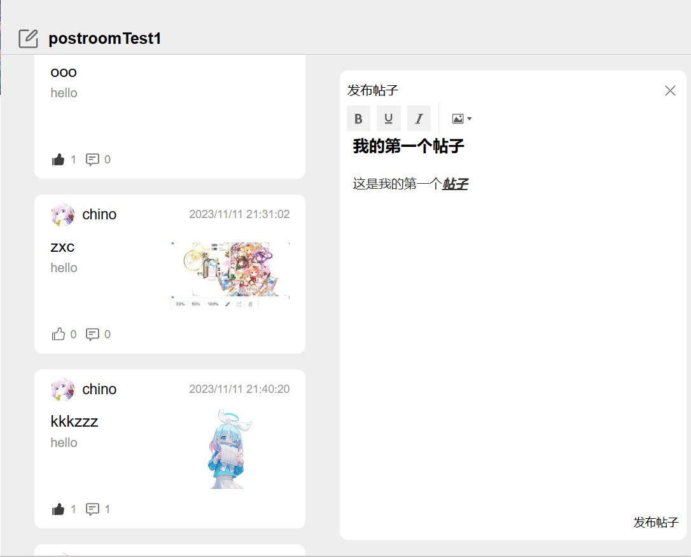
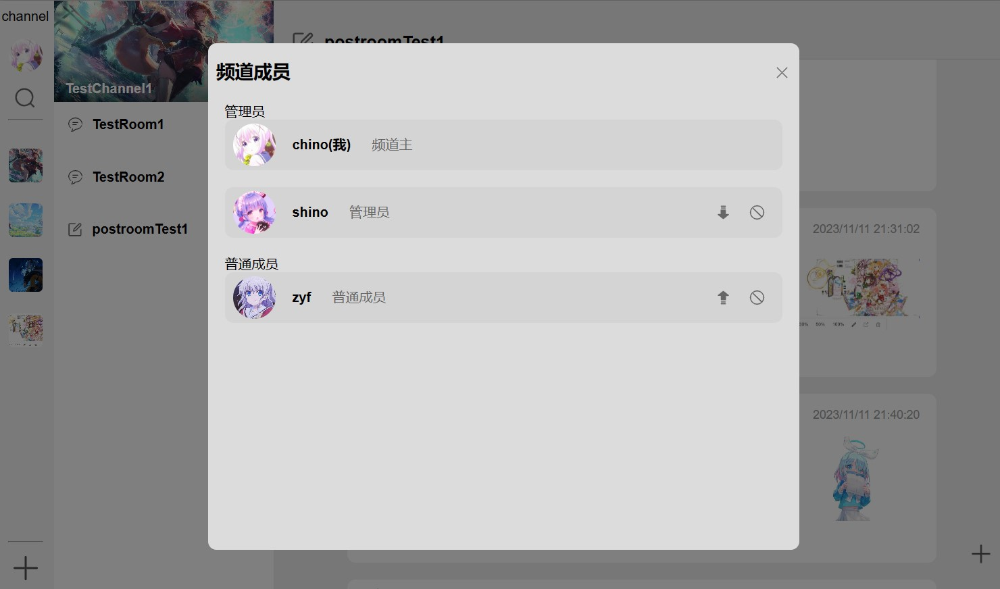
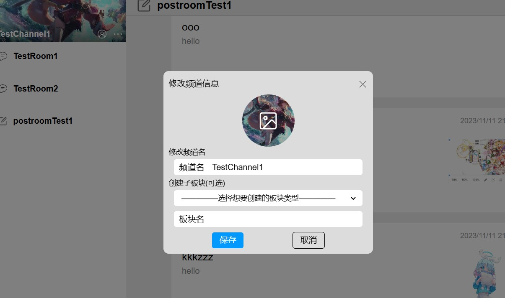
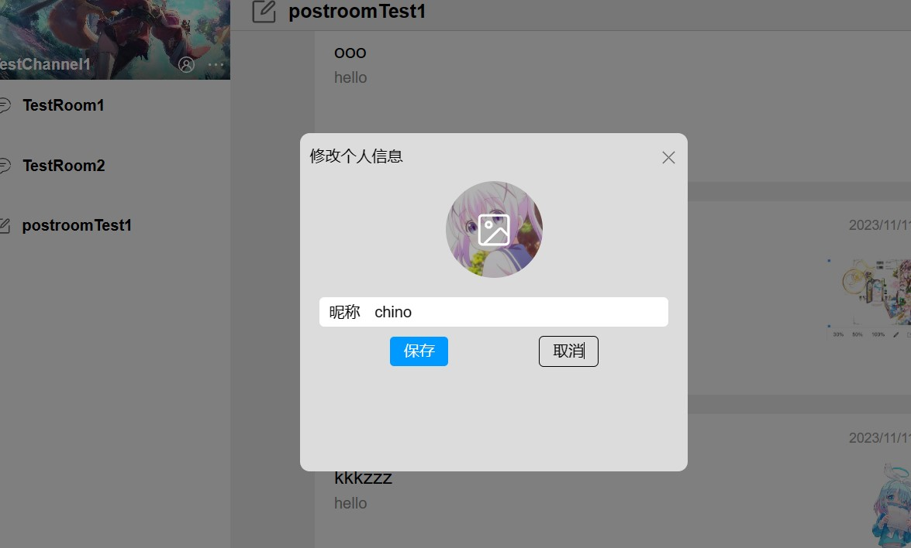
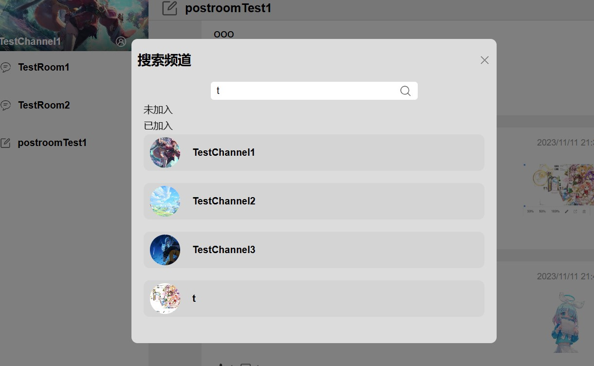
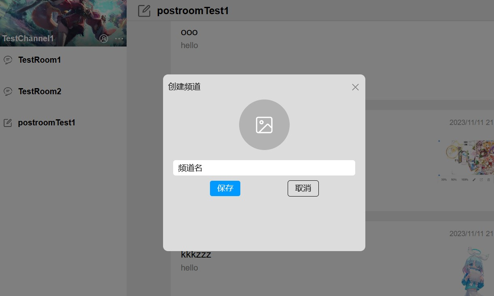

# vue3+node仿qq频道项目
 
本项目是一个基于vue3+node构建的前后端分离仿qq频道项目。前端使用vue框架搭建，服务端使用express搭建。具体功能下述说明。主页面使用vue的SPA单页面开发

## 使用方法
 
1.根据config下载相关依赖,server为服务端代码,src为客户端代码 
2.进入server运行npm run server开启服务端,进入根目录运行npm run dev开启客户端 
3.打开浏览器访问项目中配置的地址 
(注：本地项目配置了数据库,没有上传到github上)

## 项目大体功能
### -------个人信息-------
- 带token与数据库验证的登陆注册功能 
- 修改个人信息，包括头像和昵称

### -------频道操作-------
- 搜索并加入频道 
- 创建自己的频道 
- 查看加入频道的成员信息 
- 频道权限控制，三种权限：频道主、管理员、普通成员，分别具有不同权限： 
- 频道主：查看频道，频道信息修改，管理员的任免，创建板块，踢出成员，删除频道 
- 管理员：查看频道，创建板块，踢出成员，退出频道 
- 普通成员：查看频道，退出频道
### -------频道板块-------
- 聊天室板块：在线群聊，发送图片 
- 帖子板块：查看帖子，发送帖子(带图片)，评论功能，点赞功能 

## 技术栈

### 前台
1.使用vue全家桶搭建项目 
2.聊天室板块使用socket.io实现 
3.发送帖子功能使用wangeditor实现 

### 后台
express服务器 

### 数据库
mysql数据库实现数据存储

## 项目预览
主界面: 
 
聊天室: 
 
帖子： 
 
帖子详情: 
 
发送帖子: 
 
频道成员信息: 
 
管理频道(需要权限): 
 
修改个人信息: 
 
搜索频道: 
 
新建频道： 
 

